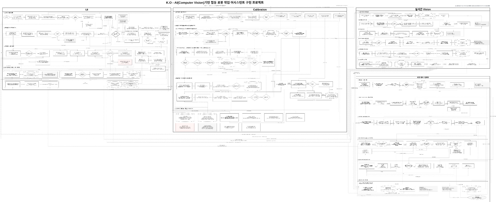

# K.O — Intelligent Robotic Boxing Training System

> **AI Vision · ROS 2 · Doosan M0609 · Force Control · Voice Interface · Web UI**  
> 사용자의 움직임을 인식하고, 협동로봇 미트가 능동적으로 반응하며, 훈련 결과를 데이터로 피드백하는 **지능형 복싱 트레이닝 시스템**입니다.

---

## 1. Project Overview

기존 샌드백은 정해진 위치를 반복 타격하는 수동적인 훈련에 가깝고, 실제 미트 훈련은 코치나 훈련 파트너가 필요합니다.  
또한 혼자 훈련할 경우 자신의 자세와 타격 정확도를 객관적으로 확인하기 어렵다는 한계가 있습니다.

**K.O**는 다음의 흐름을 하나의 시스템으로 연결하는 것을 목표로 합니다.

```text
사용자 인식
    ↓
펀치 / 자세 분석
    ↓
사용자 맞춤형 로봇 미트 제어
    ↓
실제 타격 및 Force 감지
    ↓
반발 / 복귀 / 다음 타점 전환
    ↓
훈련 데이터 저장 및 코칭 피드백
```

### 핵심 목표

- 3-Camera 기반 사용자 및 주먹 추적
- Robot BASE 기준 3D 주먹 위치·속도 산출
- 사용자 키·리치·주손 기반 미트 위치 보정
- 잽·스트레이트·훅·어퍼별 미트 위치/방향 제어
- Force 기반 실제 타격 감지 및 Rebound/Return
- Wake Word + STT 기반 비접촉 훈련 제어
- 훈련 기록, BEST/CHECK, 이전 기록 비교 및 코칭 리포트
- ROS 2 기반 Vision · Voice · UI · Robot · Force 통합

---

## 2. Full System Flowchart

<p align="center">
  
</p>

> 위 플로우차트는 **UI / Calibration / 실시간 Vision / 분석·필터링 / Robot·Force 연동**의 전체 실행 흐름을 통합하여 표현합니다.

---

## 3. System Architecture

```text
┌─────────────┐
│   USER UI   │
│ 등록/리치   │
│ 훈련/리포트 │
└──────┬──────┘
       │
       ▼
┌─────────────┐
│    VOICE    │
│ Wake Word   │
│ Whisper STT │
└──────┬──────┘
       │
       ▼
┌──────────────────────┐
│        VISION        │
│ 3-Camera Capture     │
│ YOLO11n + BoT-SORT   │
│ MediaPipe Pose       │
│ Triangulation + EKF  │
└──────────┬───────────┘
           │ 3D Position / Velocity
           ▼
┌──────────────────────┐
│      ROS 2 CORE      │
│ Session Bridge       │
│ Robot Bridge         │
│ Topic / Service      │
│ State Synchronizing  │
└──────────┬───────────┘
           │
           ▼
┌──────────────────────┐
│    ROBOT / FORCE     │
│ M0609 Mitt Position  │
│ RT Force / Hit Test  │
│ Compliance / Rebound │
│ Return / Next Hit    │
└──────────┬───────────┘
           │ HitResult
           ▼
┌──────────────────────┐
│ REPORT / COACHING    │
│ Score / BEST / CHECK │
│ History Comparison   │
│ Coaching Feedback    │
└──────────────────────┘
```

### SessionBridge

최종 통합에서는 `SessionBridge`가 훈련 세션과 HitTest 흐름을 중심적으로 관리합니다.

- 사용자별 미트 위치 요청
- HitTest 시작/종료
- `WAITING_FOR_HIT` 상태 동기화
- 실제 HitResult 저장
- Rebound/Return 종료 확인
- 콤비네이션의 다음 타점 전환
- 세션 불일치 및 중복 HitResult 차단

특히 콤비네이션은 단순 타이머가 아니라 다음과 같은 **Event 기반 시퀀스**로 동작합니다.

```text
타점 A
  ↓
실제 타격 감지
  ↓
Rebound / Return 완료
  ↓
다음 사용자 맞춤 미트 Pose 생성
  ↓
HitTest 재시작
  ↓
WAITING_FOR_HIT
  ↓
타점 B 안내
```

---

## 4. Main Features

| 영역 | 주요 기능 |
|---|---|
| **UI** | 사용자 등록, 리치 측정, 훈련 선택, USER/ADMIN 모드, 결과 리포트 |
| **Voice** | Custom Wake Word, Whisper STT, TTS/명령 구조화 |
| **Vision** | 3-Camera 입력, 복서 ID 고정, Pose/Fist 추적, 삼각측량, EKF |
| **Calibration** | 카메라 Intrinsic, Camera → Robot BASE 직접 정렬 |
| **Robot** | M0609 위빙, 사용자 맞춤형 미트 위치, 펀치별 Orientation |
| **Force** | RT 외력 감지, Hit 판정, Compliance, Rebound, Return |
| **Combination** | 실제 타격 Event 기반 잽·스트레이트·훅·어퍼 시퀀스 |
| **Report** | HitResult 저장, BEST/CHECK, 이전 기록 비교, 코칭 피드백 |
| **Safety** | Hardware Preflight, Critical Node 감시, Stale 데이터 차단 |

---

## 5. Vision Pipeline

Vision의 목표는 단순히 가장 정확한 Pose 모델을 사용하는 것이 아니라,

> **Stable ID · Low Latency · Robot-ready 3D Coordinate**

를 확보하는 것입니다.

### Hybrid Tracking

```text
YOLO11n + BoT-SORT
        ↓
복서 Person ID 고정 / ROI 선택
        ↓
MediaPipe Pose
        ↓
손목·팔꿈치 관절 추론
        ↓
LEFT / FRONT / RIGHT 촬영 시각 정렬
        ↓
2대 이상 카메라 기반 3D Triangulation
        ↓
RealSense Depth 비교 / 보조
        ↓
EKF Position + Velocity Tracking
        ↓
Robot BASE 3D 좌표 발행
```

### 왜 Hybrid 구조인가?

- **MediaPipe 단독**
  - 빠른 관절 추론
  - 지속적인 Person ID가 없어 가림/다중 인물 상황에서 대상 전환 가능

- **YOLO11n + BoT-SORT 단독**
  - 안정적인 Track ID
  - 3대 카메라에서 Pose까지 동시에 처리하면 연산 부하 증가

- **최종 구조**
  - YOLO + BoT-SORT: **사용자 ID 고정**
  - MediaPipe: **ROI 내부의 빠른 관절 추론**
  - Latest Frame 처리: **오래된 프레임 누적 방지**

### EKF

EKF는 손목 위치와 속도를 동시에 추정하여 카메라 노이즈와 순간적인 좌표 튐을 완화합니다.

```text
3D 측정값
   ↓
이전 위치 + 속도 기반 상태 예측
   ↓
실제 측정값과 결합
   ↓
Innovation Outlier 제거
   ↓
Stale 데이터 차단
   ↓
최종 Position / Velocity
```

---

## 6. Camera ↔ Robot Calibration

세 카메라를 카메라끼리 Pairwise 방식으로 연쇄 연결하지 않고,  
각 카메라를 **Robot BASE에 직접 1:1 정렬**하는 구조를 사용합니다.

```text
Front Camera ─────┐
Left Camera  ─────┼──→ Robot BASE
Right Camera ─────┘
```

### 처리 과정

1. 카메라별 Intrinsic Calibration
2. ChArUco 보드를 로봇 Flange에 장착
3. 여러 Robot Pose에서 동시 데이터 수집
   - `T_base_flange`
   - `T_cam_board`
4. 복수 샘플의 위치·회전 오차 최소화
5. 카메라별 `T_base_camera` 산출
6. 최종 3D 좌표를 Robot BASE로 통합

### 주요 파일

```text
calibration/
├── intrinsics/
│   ├── front.yaml
│   ├── left.yaml
│   └── right.yaml
└── results/
    └── robot_world.yaml
```

---

## 7. Robot Mitt Control

### Weaving Idle Motion

훈련 대기 중에는 로봇이 정지 상태로만 기다리지 않고 복싱의 회피 동작인 **위빙(Weaving)**을 수행합니다.

```text
HOME
  ↓
MITT / WEAVE Ready
  ↓
Weaving Idle Motion
  ↓
Wake Word / Training Command
  ↓
Soft Stop
  ↓
Training Ready
```

### User-specific Mitt Pose

사용자의 신체 정보를 기준으로 로봇 미트의 위치를 재계산합니다.

입력:

- 키
- 좌/우 리치
- 주손
- 훈련 종류
- 펀치 종류

출력:

```text
Target Pose = [X, Y, Z, A, B, C]
```

### Punch Orientation

| 펀치 | 미트 제어 |
|---|---|
| **JAB / STRAIGHT** | 정면 타격면 유지 |
| **HOOK** | 측면 위치 이동 + Yaw 회전 |
| **UPPERCUT** | 상향 진입 방향에 맞춰 미트 각도 변경 |

---

## 8. Force / Hit / Rebound

로봇 외력을 실시간으로 모니터링하여 실제 타격을 감지합니다.

```text
WAITING
  ↓
Force / Moment Monitoring
  ↓
HIT DETECTION
  ↓
Impact Analysis
  ↓
REBOUND
  ↓
RETURN
  ↓
WAITING_FOR_HIT
```

주요 처리 항목:

- 실시간 외력 측정
- Peak Force
- Impulse
- Contact Time
- 타격 위치 추정
- Center Error
- HitResult 저장
- Compliance / Rebound / Return

---

## 9. User Training Flow

```text
1. HOME 이동
2. Weaving 시작
3. 사용자 이름/정보 입력
4. 신규/기존 사용자 구분
5. 신규 사용자는 키·리치 측정
6. 훈련 종류 / 펀치 / 콤비네이션 선택
7. Guard Ready 확인
8. 사용자 맞춤 미트 위치 이동
9. Force 안정화 및 WAITING_FOR_HIT
10. Countdown / GO
11. 실제 타격
12. Rebound / Return
13. 다음 타점 또는 훈련 종료
14. 결과 저장 및 Report 생성
15. 재훈련 또는 종료
```

---

## 10. Hardware

| 장치 | 구성 |
|---|---|
| Collaborative Robot | **Doosan M0609** |
| Front Camera | **Intel RealSense D435/D435i RGB + Depth** |
| Side Cameras | **Logitech C270 × 2** |
| End Effector | 평면 복싱 미트 + 전용 Tool Adapter |
| Audio | Microphone |
| Control PC | Ubuntu 22.04 / ROS 2 Humble 환경 |

기본 카메라 Runtime 해상도:

```text
640 × 480 @ 30 FPS
```

---

## 11. Software Stack

### Platform

- Ubuntu 22.04
- ROS 2 Humble
- Python 3.10

### AI / Vision

- YOLO11n
- BoT-SORT
- MediaPipe Pose
- OpenCV
- Intel RealSense SDK
- NumPy / SciPy
- EKF

### Voice

- openWakeWord
- Whisper STT
- Piper / TTS

### UI / Data

- Flask
- HTML / CSS / JavaScript
- SQLite

### Robot / Force

- Doosan ROS 2
- M0609 Motion Control
- RT Force
- Compliance / Rebound / Return

---

## 12. Repository Structure

```text
KO/
├── calibration/             # 최종 Intrinsic / Robot World 결과
├── calibration_tools/       # 카메라 및 Robot BASE 캘리브레이션 도구
├── config/                  # Camera / Runtime / Mitt 설정
├── data/                    # 훈련 및 Hit 기록
├── force_control/
│   └── boxing_robot_ws/     # ROS 2 Force / Hit / SessionBridge Workspace
├── interfaces/              # 인터페이스 정의
├── models/                  # Vision 관련 모델
├── msg/                     # 메시지 스키마
├── output/
│   └── impacts/             # 타격 이미지 및 Metadata
├── robot_control/           # M0609 Weaving / UI-Robot Bridge
├── sandbag_vision/          # 실시간 3-Camera Vision Runtime
├── tests/                   # 통합 테스트
├── tools/                   # Preflight / Configuration 검사
├── ui/                      # Flask UI / Voice / Reporting / DB
├── setup.sh
├── run_final.sh
├── test_final.sh
├── stop_final.sh
├── FINAL_INTEGRATION.md
└── FINAL_TEST_REPORT.md
```

---

## 13. Setup

> 권장 환경: **Ubuntu 22.04 + ROS 2 Humble + Python 3.10**

프로젝트 루트에서 실행합니다.

```bash
chmod +x setup.sh run_final.sh test_final.sh stop_final.sh
./setup.sh --build-force
```

`setup.sh`는 Vision/UI 환경을 준비하고, `--build-force` 옵션을 사용하면 번들된 Force ROS 2 workspace도 함께 빌드합니다.

---

## 14. Preflight / Verification

### Software Test

실제 장비 I/O 및 로봇 모션 없이 소프트웨어 구조를 검사합니다.

```bash
./test_final.sh
```

현재 최종 통합본의 자동 검증 범위:

```text
Final Integration Contract      PASS
Python Syntax                   105 files / 0 errors
YAML Parse                       15 files / 0 errors
UI / API                         42 / 42 PASS
Force / Rebound / Mitt Logic     94 / 94 PASS
Vision Core                      16 / 16 PASS
```

### Hardware Preflight

실제 카메라·마이크·ROS·Doosan 서비스 연결을 검사하지만,  
**프로젝트 로봇 모션은 실행하지 않습니다.**

```bash
./test_final.sh --hardware
```

주요 검사:

- C270 LEFT / RIGHT 물리 장치 매핑
- RealSense RGB + Depth
- 640×480 유효 프레임 수신
- 마이크 입력
- Wake Word 모델 초기화
- ROS 2 / Doosan 필수 서비스
- Force workspace overlay

하드웨어 프리플라이트에 실패하면 `run_final.sh`의 실제 프로젝트 동작 시작이 차단됩니다.

---

## 15. Run

> 실제 실행 전 `roboton` 및 Doosan 관련 서비스가 정상 준비되어 있어야 합니다.

### USER Mode

```bash
./run_final.sh
```

사용자 훈련 중심 화면으로 실행합니다.

### ADMIN Mode

```bash
./run_final.sh --admin-mode
```

ADMIN 화면에서는 다음 정보를 확인할 수 있습니다.

- LEFT / FRONT / RIGHT Camera Preview
- Pose / Guard / Impact 상태
- Robot BASE Position / Velocity
- 시스템 상태 및 개발 진단 정보

### Stop / Restart

```bash
./stop_final.sh
```

비정상 종료 후 중복 실행이나 lock 문제가 발생하면 `stop_final.sh`로 KO 프로젝트 프로세스를 정리한 뒤 다시 실행합니다.

---

## 16. Calibration Tools

카메라 또는 설치 위치가 변경된 경우 재검증이 필요합니다.

```bash
python3 calibration_tools/00_check_cameras.py --assign-c270
python3 calibration_tools/01_intrinsic_calibration.py --camera front
python3 calibration_tools/02_collect_external_samples.py --camera front
python3 calibration_tools/03_solve_external_calibration.py
python3 calibration_tools/04_validate_robot_world.py --camera front
```

상세 내용은 다음 문서를 참고합니다.

```text
calibration_tools/README.md
```

---

## 17. Data / Output

### Impact Evidence

```text
output/impacts/
└── impact_XXXXX_YYYYMMDD_HHMMSS_xxxxxx/
    ├── left_raw.jpg
    ├── front_raw.jpg
    ├── right_raw.jpg
    ├── left.jpg
    ├── front.jpg
    ├── right.jpg
    ├── impact_triptych.jpg
    └── impact_metadata.json
```

### Training / Hit Records

```text
data/hit_records/
ui/instance/ko.sqlite3
```

---

## 18. Safety Notes

이 프로젝트는 사용자가 실제로 협동로봇의 미트를 타격하는 구조이므로,  
소프트웨어 테스트 통과와 실제 물리 안전 검증을 반드시 구분해야 합니다.

### 첫 실물 구동 권장 순서

```text
1. 작업영역에서 사람 제거
2. HOME Pose 저속 확인
3. MITT / WEAVE Ready Pose 확인
4. Weaving 궤적 및 주변 기구 간섭 확인
5. Wake Word Soft Stop 확인
6. 단일 펀치 위치 이동 확인
7. WAITING_FOR_HIT 상태 확인
8. 약한 타격으로 Force / Rebound 확인
9. 단일 펀치 검증 후 콤비네이션 진행
```

자동 테스트의 `PASS`는 소프트웨어 연결 계약과 로직이 준비되었다는 의미이며,  
실제 사용자 거리, 기구 간섭, Compliance 체감, 반복 타격 안전성은 물리 환경에서 별도로 검증해야 합니다.

---

## 19. Current Limitations & Future Work

- 카메라 설치 위치 변화에 따른 Calibration 재검증 필요
- 고속 펀치 및 가림 환경에서 더 많은 사용자 데이터 검증 필요
- 실제 M0609 반복 타격 안전성 데이터 추가 축적 필요
- 훅/어퍼컷의 사용자별 세부 Target Pose 튜닝
- 자세 점수 및 Force Accuracy 기반 Scoring 고도화
- 장기 훈련 기록 및 관리자 분석 기능 고도화

---

## 20. Team

**Team E-3**

- 정용준
- 정진목
- 김승주
- 김윤식

---

## 21. Project Summary

> **K.O는 “움직임 인식 → 판단 → 물리 반응 → 데이터 피드백”을 하나의 ROS 2 기반 폐루프 시스템으로 연결한 사람 반응형 로봇 복싱 트레이닝 프로젝트입니다.**
